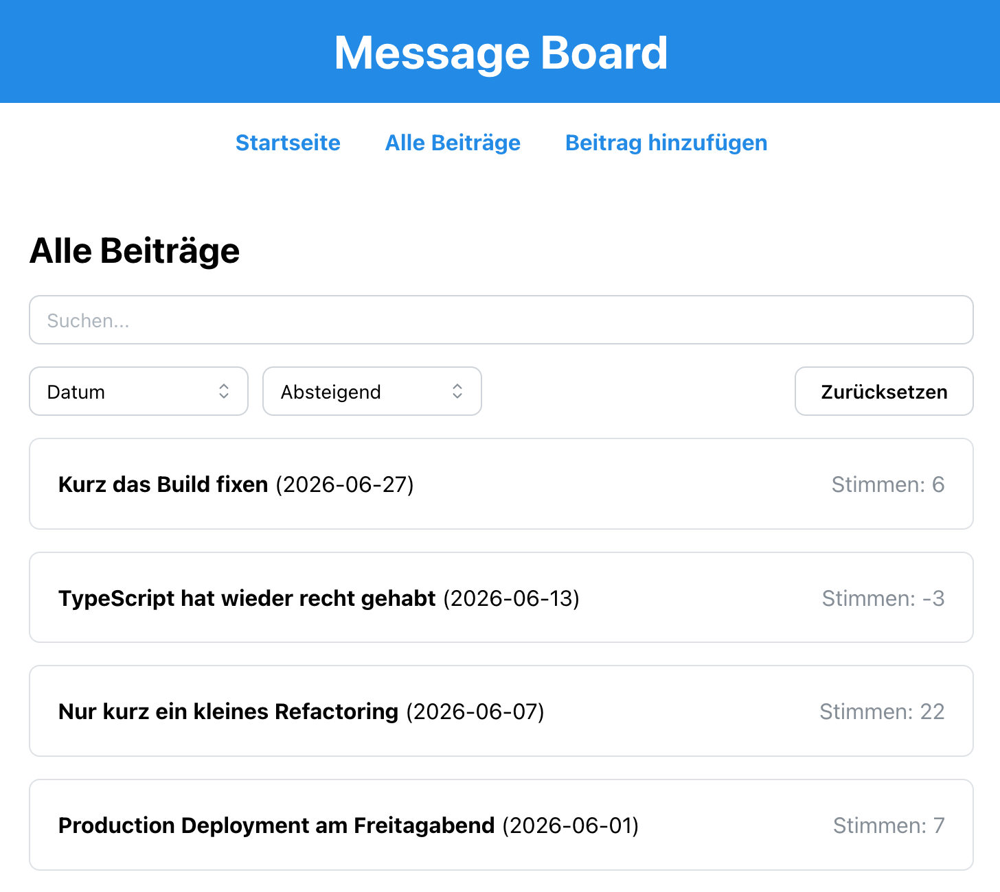
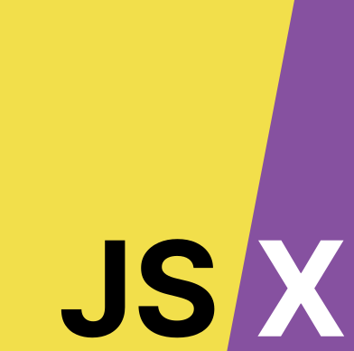
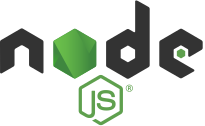
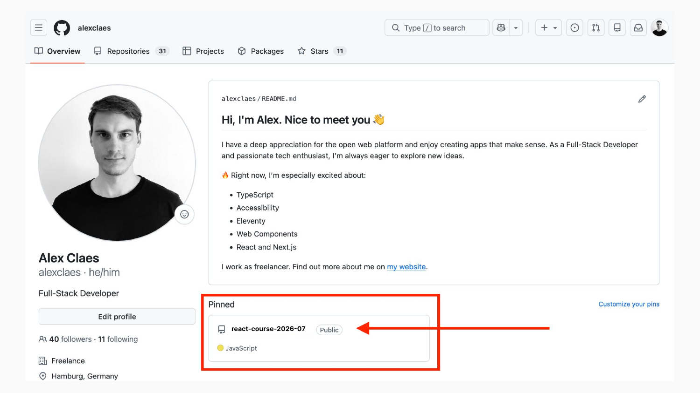
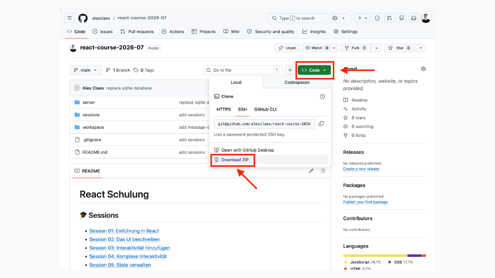

<!-- _class: lead -->
<!-- _paginate: false -->

# Herzlich willkommen 👋

React, Vite, TypeScript

---

<!-- _class: lead -->

# Vorstellungsrunde

---

## Hi, ich bin Alex

- Alex Claes
- 38 Jahre
- Webentwicklung seit 20 Jahren
- Berufsausbildung: Mediengestaltung
- Studium: Wirtschaftsinformatik
- Im 10. Jahr freiberuflicher Softwareentwickler, Berater, Dozent
- Arbeit mit React seit 8 Jahren

---

<!-- _class: lead -->

# Wer seid ihr? 🤔

---

## Mich interessiert

- Dein Name
- Dein Jobtitel / -beschreibung
- Kurze Beschreibung deines technischen Kontexts
- Erfahrung mit React
- Erfahrung mit TypeScript

---

<!-- _class: lead -->

# Der Prozess

---

## Hands-on-Übungen

- Lernpfad ist aufgeteilt in Sessions
- Jede Session hat festgelegte Lernziele
- Jede Session besteht aus praktischen Übungen
- Übungen bauen aufeinander auf
- Wir werden die Übungen gemeinsam bearbeiten

Schritt für Schritt die Entwicklung einer Anwendung — auf dem Weg React-Konzepte erlernen und anwenden

---

<!-- _class: lead -->

# Das Ziel: Message Board

---

<!-- _class: image-fit -->

---

<!-- _class: lead -->

# Fragen?

---

<!-- _class: lead -->

# Tech Stack

---

<!-- _class: columns -->

## Tech Stack

**Coding:**

- TypeScript
- React
- JSX

**Tooling:**

- node
- npm
- vite

---

<!-- _class: columns tech -->

## TypeScript

- Erweiterung von JavaScript um statische Typen
- Typen werden zur Entwicklungszeit geprüft, nicht zur Laufzeit im Browser
- Bessere Autovervollständigung und frühere Fehlererkennung in der IDE
- Wird zu JavaScript kompiliert — der Browser führt weiterhin JavaScript aus

---

<!-- _class: columns tech -->

## React

- JavaScript-Bibliothek für interaktive Benutzeroberflächen im Browser
- UI aus wiederverwendbaren Komponenten zusammensetzen
- Deklarativ: gewünschtes UI beschreiben — React übernimmt DOM-Updates
- UI passt sich automatisch an, wenn sich der State ändert

---

<!-- _class: columns tech -->

## JSX

- HTML-ähnliche Syntax zum Beschreiben von UI
- Wird vor dem Ausführen zu JavaScript kompiliert — kein natives Browser-Feature
- Macht React-Komponenten lesbarer
- Nicht exklusiv für React

---

<!-- _class: columns tech -->

## node

- JavaScript-Laufzeitumgebung außerhalb des Browsers
- Führt JavaScript lokal auf dem Rechner und auf Servern aus
- Grundlage für npm, Vite und den lokalen Dev-Server
- Ermöglicht Build-Tools, Skripte und serverseitige Anwendungen

---

<!-- _class: columns tech -->

## npm

- Node Package Manager — Standard-Werkzeug für JavaScript-Projekte
- Installiert Bibliotheken wie React und Vite aus der npm-Registry
- Verwaltet Abhängigkeiten über die `package.json`
- Stellt Befehle wie `npm install` und `npm run dev` bereit

---

<!-- _class: columns tech -->

## vite

- Build-Tool
- Erstellt per Scaffolding die Projektstruktur
- Schneller lokaler Dev-Server mit Hot Module Replacement (HMR)
- Transpiliert TypeScript/JSX und erzeugt den optimierten Production-Build

---

<!-- _class: lead -->

# Ready?

---

## https://**github.com/alexclaes**

Kursmaterial herunterladen

---

<!-- _class: image -->

---

<!-- _class: image -->

---

<!-- _class: lead -->

# Entpacken und Sichten
