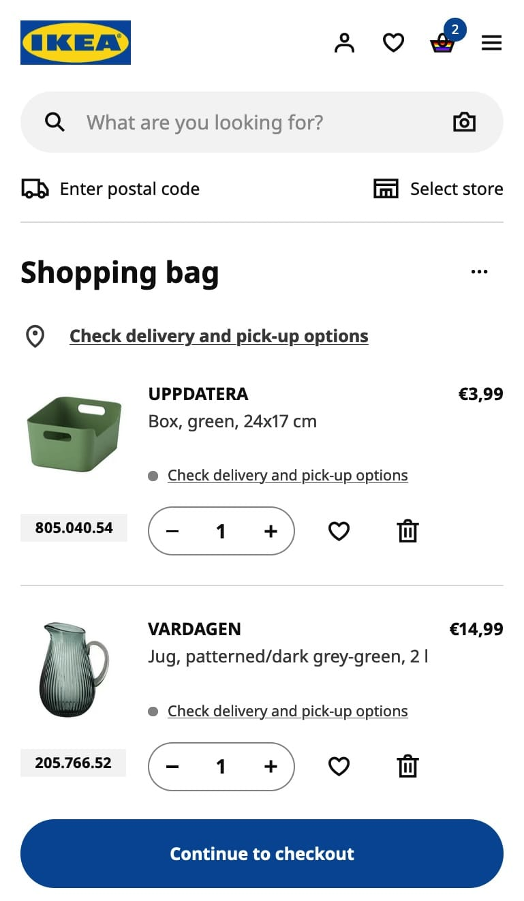

[Zurück zur Session-Übersicht](../readme.md)

**Session 01 - Übung B**

# Components für eine gesamte Seite definieren

## Aufgabe: Components identifizieren

Markiere die einzelnen UI-Components auf dem Screenshot (z. B. mit [Excalidraw](https://excalidraw.com/)) und benenne jede in **CamelCase**.
