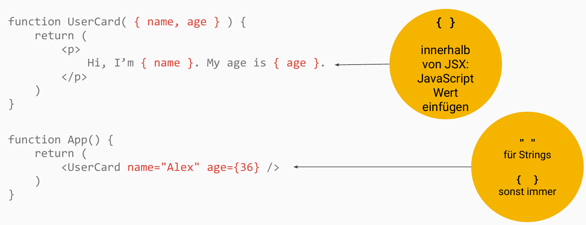
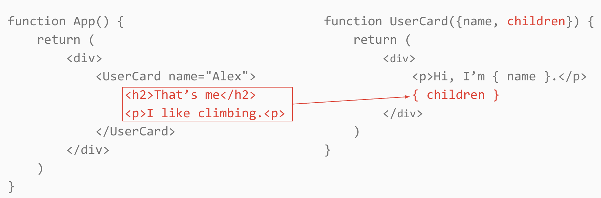
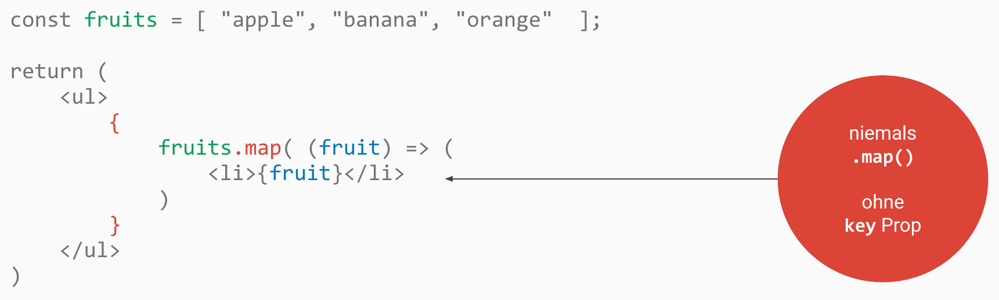
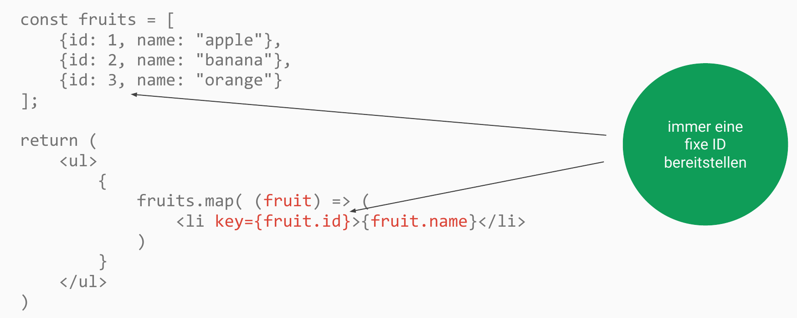
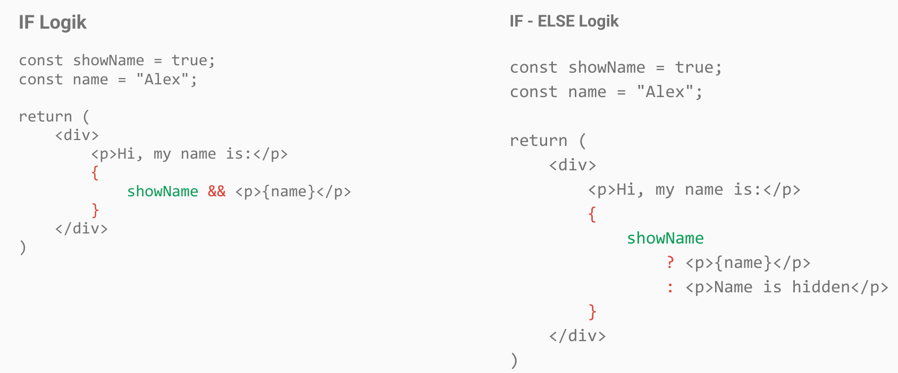

<!-- _class: lead -->
<!-- _paginate: false -->

# Beschreiben des UI

Session 02

---

<!-- _class: lead -->

# Hierarchie von Komponenten

---

<!-- _class: columns -->

<div class="columns-wrap">
<div>

```jsx
function App() {
  return (
    <div>
      <NavBar />
    </div>
  );
}

function NavBar() {
  return (
    <nav>
      <NavLink />
      <NavLink />
    </nav>
  );
}

function NavLink() {
  return (
    <a href="...">
      <Icon /> Some label here
    </a>
  );
}
```

</div>
<div>

- App
  - NavBar
    - NavLink
      - Icon
    - NavLink
      - Icon

</div>
</div>

---

<!-- _class: lead -->

# Props

---

<!-- _class: image-headline -->

## Daten an Komponenten reichen



---

## Übungen

**02a** und **02b**

---

<!-- _class: lead -->

# Besondere Prop: children

---

<!-- _class: image -->



---

## Übungen

**02c** und **02d**

---

<!-- _class: lead -->

# Externe Pakete

---

## Pakete via npm installieren

- Nicht alles selbst bauen: fertige Bibliotheken aus dem npm-Registry nutzen
- Installation mit npm install
- Beispiel: **Mantine** — UI-Komponenten wie `Button`, `Card`, `Group`
- Import in React-Komponenten und direkt in JSX verwenden

---

## Übungen

**02e**

---

<!-- _class: lead -->

# Daten aus Arrays rendern

---

<!-- _class: image -->



---

<!-- _class: image -->



---

## Übungen

**02f**

---

<!-- _class: lead -->

# Conditional Rendering

---

<!-- _class: image -->



---

## Übungen

**02g**
