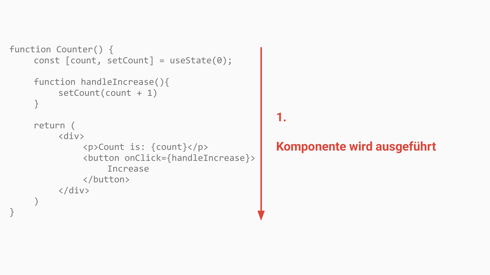
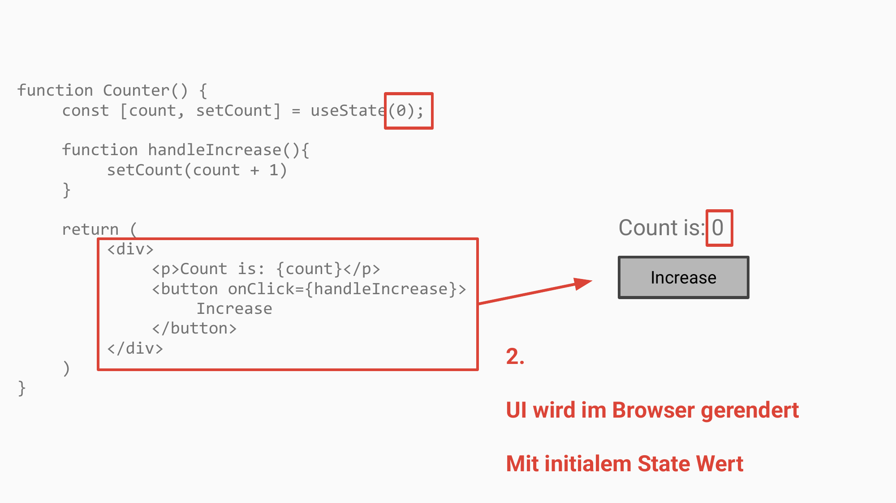
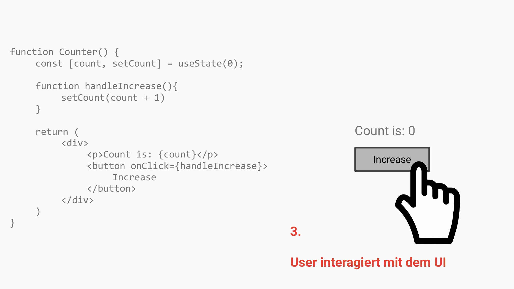
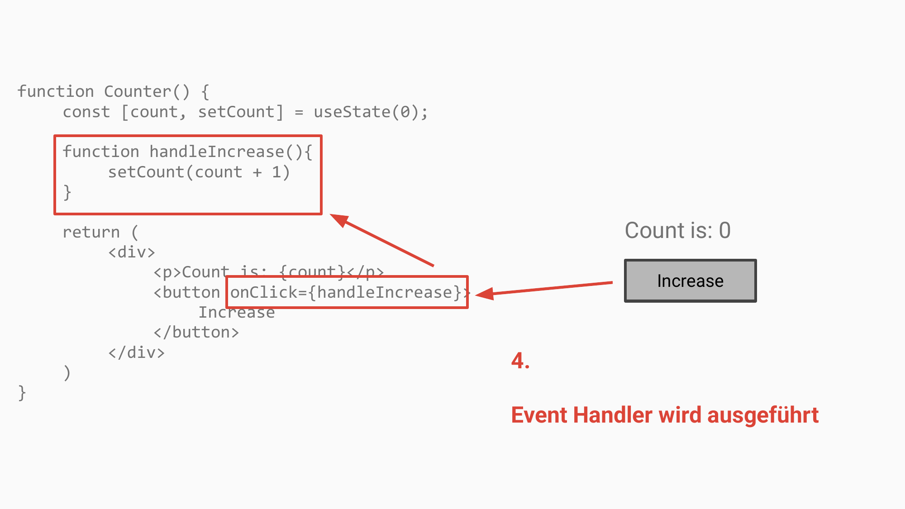
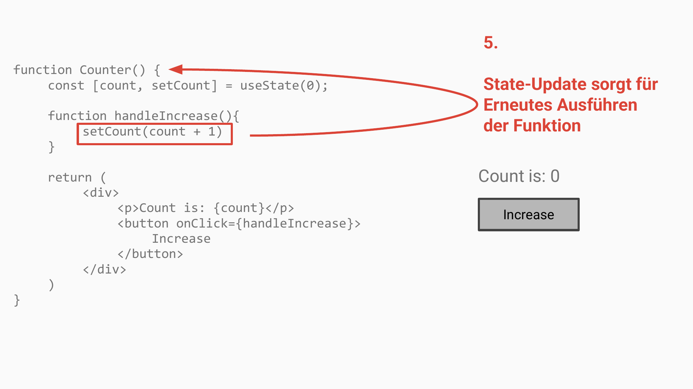
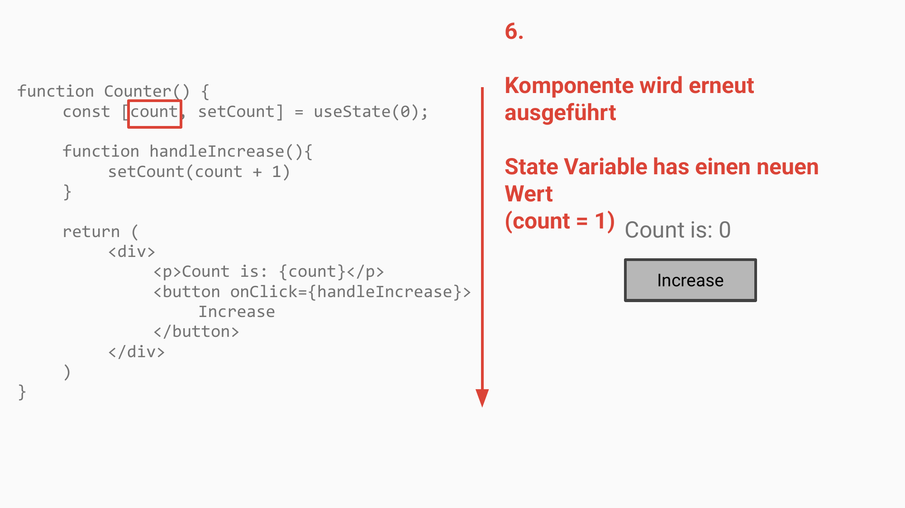
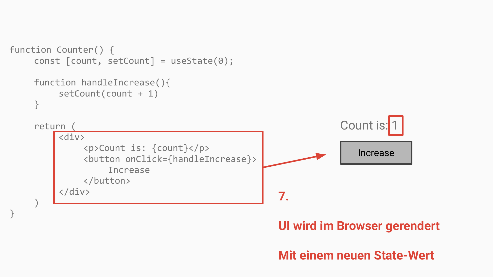

<!-- _class: lead -->
<!-- _paginate: false -->

# Interaktivität hinzufügen

Session 03

---

<!-- _class: lead -->

# Was ist State?

---

## State ist

Applikationsdaten, die sich über die Laufzeit verändern.

(zum Beispiel nach Nutzerinteraktionen)

---

## Übungen

**03a**

<!-- _class: lead -->

---

# Was sind Event Handler?

---

## Was sind Event Handler?

**Werden zu UI-Elementen hinzugefügt:**
Assoziation mit spezifischen UI-Elementen durch Event-Listener.

**Reaktion auf Nutzeraktionen:**
Werden in Reaktion auf Nutzeraktionen verarbeitet (Klicks, Tastendruck).

---

<!-- _class: lead -->

# State Handling in React

---

<!-- _class: image -->



---

<!-- _class: image -->



---

<!-- _class: image -->



---

<!-- _class: image -->



---

<!-- _class: image -->



---

<!-- _class: image -->



---

<!-- _class: image -->



---

## Übungen

**03b**

---

<!-- _class: lead -->

# React Hooks

---

## Was sind Hooks?

- Funktion einer React-Komponente erweitern.
- Logik, die im Hintergrund bleibt und ausgelagert ist
- Funktionen, die mit `use` beginnen

---

## Die Regeln von Hooks

Hooks werden immer auf oberster Ebene in einer Komponenten-Funktion aufgerufen

- 🔴 Nicht innerhalb von Schleifen
- 🔴 Nicht nach dem return-Statement
- 🔴 Nicht innerhalb von Event-Handlern
- 🔴 Nicht innerhalb sonstiger Funktionen
- 🔴 Nicht innerhalb von konditionaler Logik (IF-ELSE)

---

## Wie und wo Hooks aufrufen?

### Immer am Anfang einer Komponente

```jsx
function Counter() {
  const [count, setCount] = useState(0);

  // ... more code
}
```

---

## Übungen

**03c**
