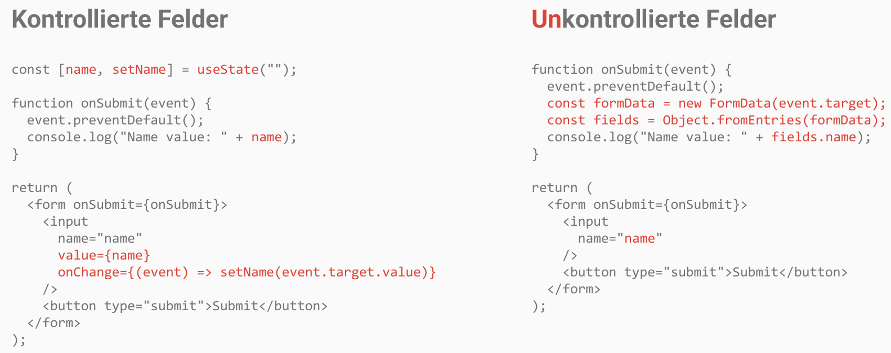

<!-- _class: lead -->
<!-- _paginate: false -->

# Komplexe Interaktivität

Session 04

---

## Übungen

**04a** bis **04d**

---

<!-- _class: lead -->

# Formulare und Eingabefelder

---

<!-- _class: columns -->

## Kontrollierte vs. Unkontrollierte Felder

**Kontrollierte Felder**

- State wird direkt von React verarbeitet
- `value` und `onChange` Prop bei `input`

Ein Feld soll individuell verarbeitet werden

**Unkontrollierte Felder**

- State wird vom Browser (DOM) verarbeitet
- `onSubmit` oder `action` bei `<form>`

Alle Felder eines Formulars gemeinsam verarbeiten

---

<!-- _class: image -->

---

## Kontrollierte vs. Unkontrollierte Felder

|     | Kontrolliert                  | Unkontrolliert                                      |
| --- | ----------------------------- | --------------------------------------------------- |
| Pro | Reaktion auf jede Taste       | Kein State-Handling pro Feld erforderlich           |
| Con | Erfordert viel State-Handling | Reaktion nur auf das Versenden kompletter Formulare |

---

## Übungen

**04e**
