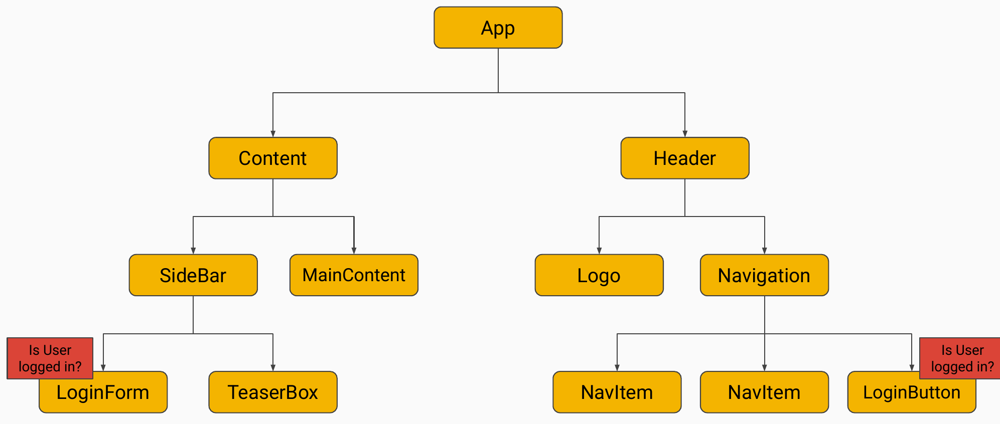
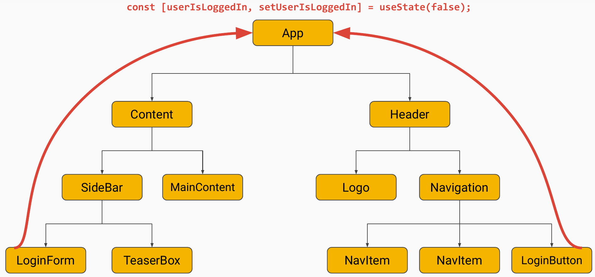
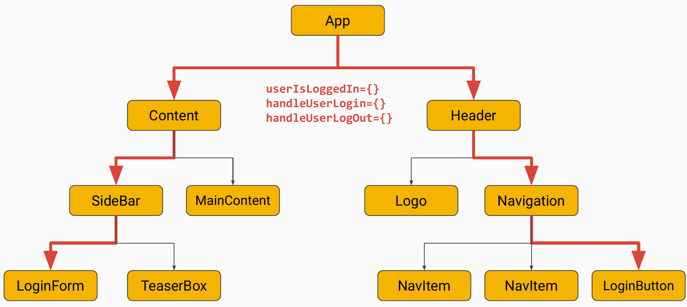
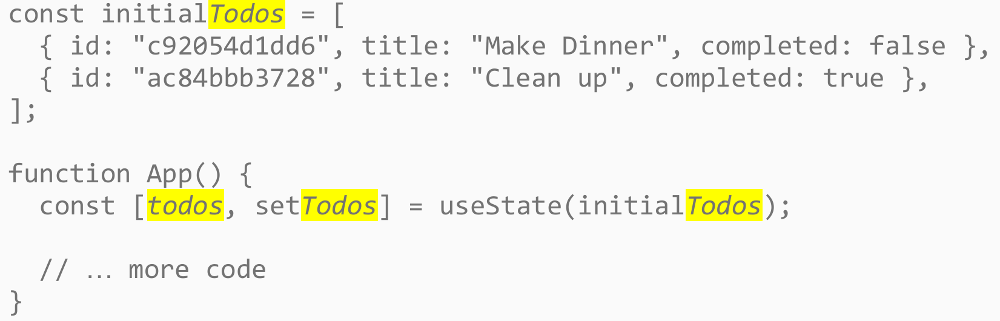
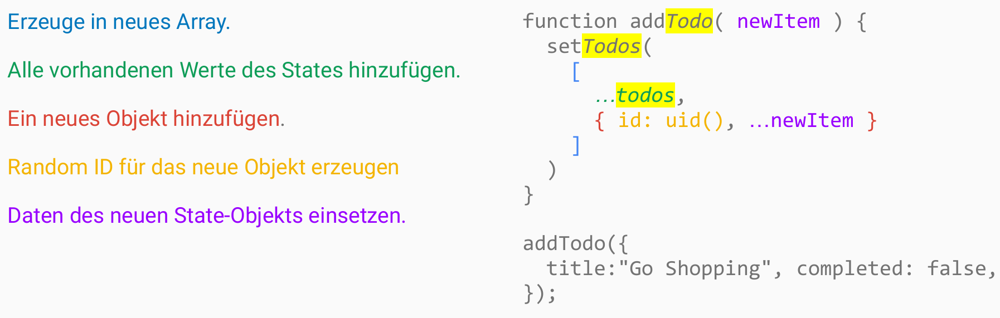
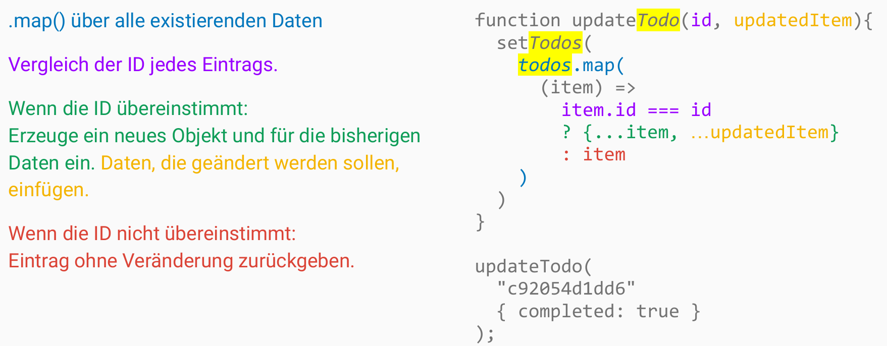
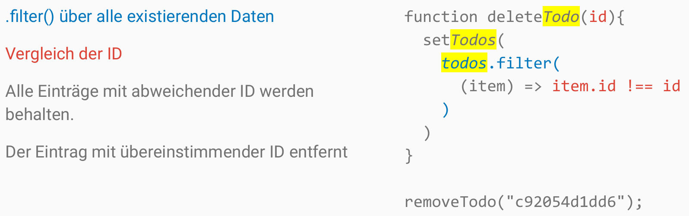

<!-- _class: lead -->
<!-- _paginate: false -->

# Managing State

Session 05

---

<!-- _class: lead -->

# State zwischen Komponenten teilen

---

<!-- _class: image -->

---

<!-- _class: lead -->

# Lifting State Up!

---

<!-- _class: image-headline -->

## Lifting State Up: zum ersten gemeinsamen Vorfahren

---

<!-- _class: image-headline -->

## Daten und Funktionen via Props herunterreichen

---

<!-- _class: lead -->

# Objekte in Arrays in State

---

<!-- _class: image-headline -->

## Setup

---

<!-- _class: image-headline -->

## Hinzufügen

---

## Übungen

**05a**

---

<!-- _class: image-headline -->

## Ändern

---

## Übungen

**05b**

---

<!-- _class: image-headline -->

## Löschen

---

## Übungen

**05c**

---

<!-- _class: lead -->

# Prop-Drilling

---

## Das Problem von Prop-Drilling

- State und Funktionen liegen weit oben — z. B. in `App`
- Jede Zwischenebene muss Props entgegennehmen und weitergeben
- Komponenten in der Mitte transportieren Daten, die sie selbst nicht brauchen
- Tieferer Komponentenbaum → viele unnötige Props → unübersichtlicher Code

---

<!-- _class: lead -->

# Eine Lösung: React Context

---

## React Context

- Alternative zum Durchreichen über viele Ebenen
- Ein **Provider** stellt Daten für einen Teilbaum bereit
- Tief liegende Komponenten lesen per **Hook** direkt aus dem Context
- Geteilte Daten ohne Prop-Drilling durch die Zwischenebenen

---

## Übungen

**05d** und **05e**
