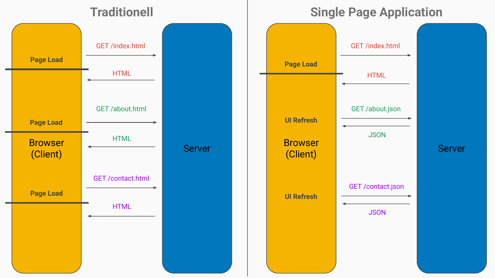
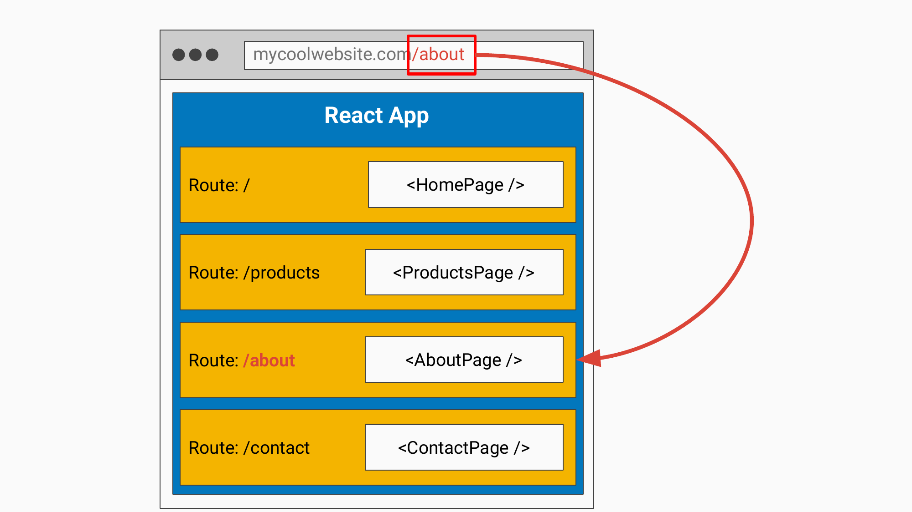
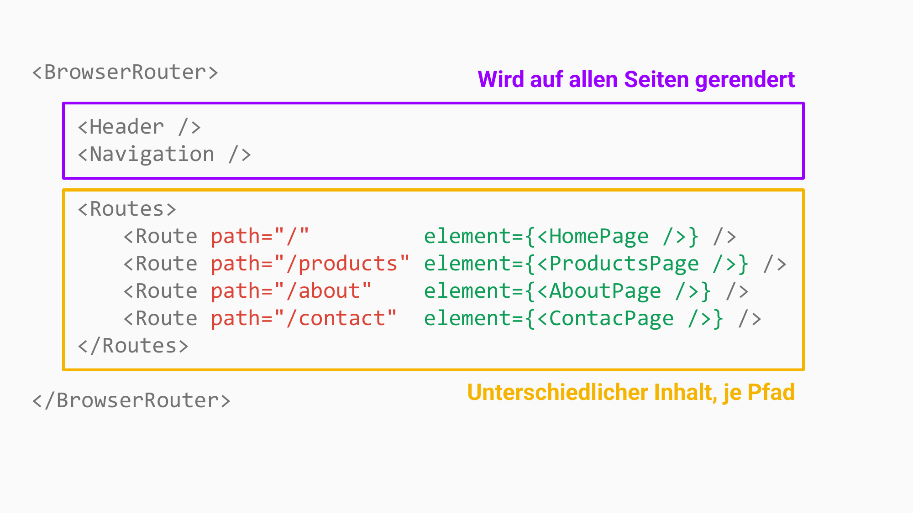

<!-- _class: lead -->
<!-- _paginate: false -->

# Routing

Session 06

---

<!-- _class: lead -->

# Single Page Application (SPA)

---

<!-- _class: image -->

---

<!-- _class: lead -->

# Routing in React

---

<!-- _class: image -->

---

<!-- _class: image -->

---

## Übungen

**06a** bis **06e**
