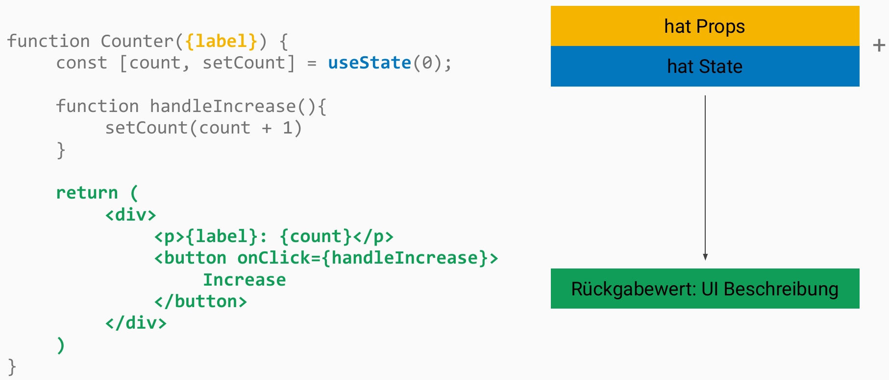
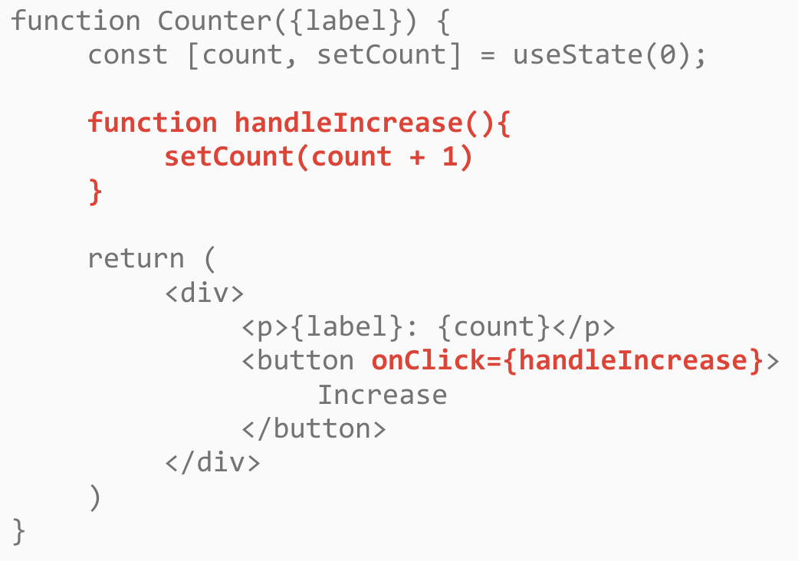
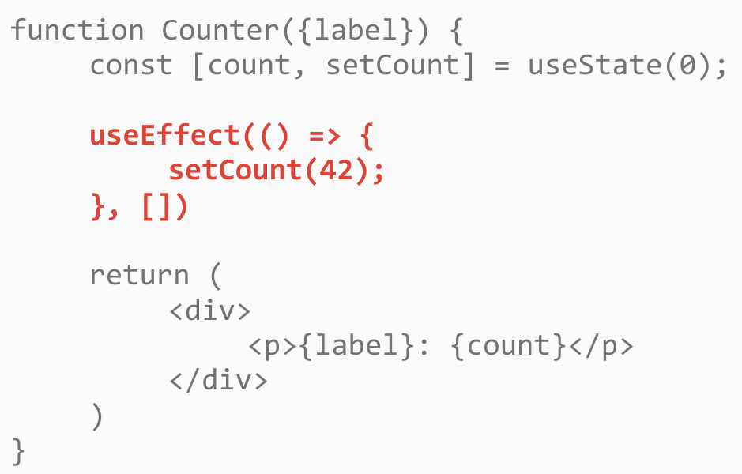
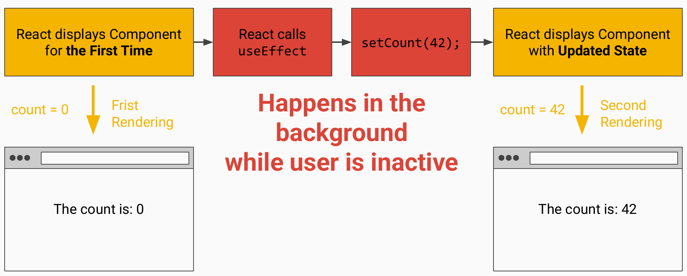
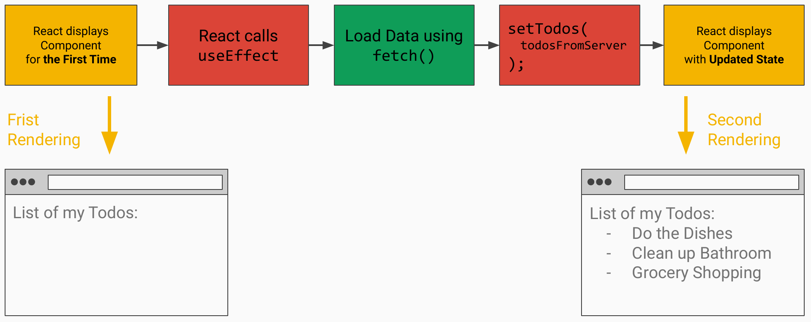

<!-- _class: lead -->
<!-- _paginate: false -->

# Server Sync

Session 07

---

<!-- _class: lead -->

# UI in React aktualisieren

---

<!-- _class: image -->

---

<!-- _class: lead -->

# Aktualisierung der Anzeige  erfordert IMMER ein State-Update

---

## Auslösen von State-Updates

**Events**
Ausgelöst durch Nutzerinteraktion

- `<button onClick>`
- `<form onSubmit>`
- `<input onChange>`

---

<!-- _class: image -->

---

<!-- _class: columns -->

## Auslösen von State-Updates

**Events**
Ausgelöst durch Nutzerinteraktion

- `<button onClick>`
- `<form onSubmit>`
- `<input onChange>`

**Seiteneffekte**
Ausgelöst durch React selbst, nachdem eine Komponente gerendert wurde

Werden automatisch ausgeführt, ohne Nutzerinteraktion

`useEffect` Hook

---

<!-- _class: image -->

---

<!-- _class: lead -->

# Timeline eines Seiteneffekts

---

<!-- _class: image -->

---

<!-- _class: lead -->

# Dieses Muster wird genutzt, um Daten von einem Server / einer API zu laden

---

<!-- _class: image -->

---

<!-- _class: image -->

![TodoList: useState([]), async loadTodos() mit fetch(), useEffect, .map() mit key={todo.id}](assets/effect-example.png)

---

## Übungen

**07a** bis **07f**
